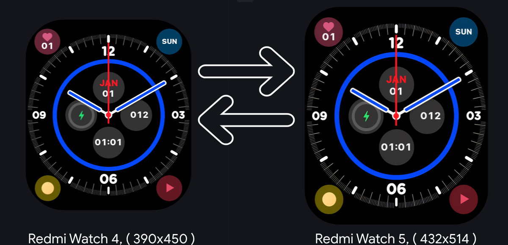
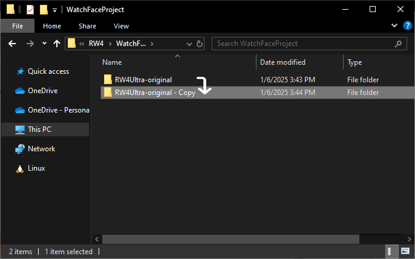
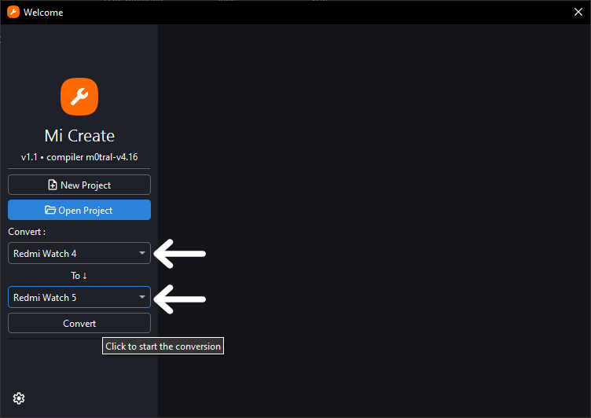
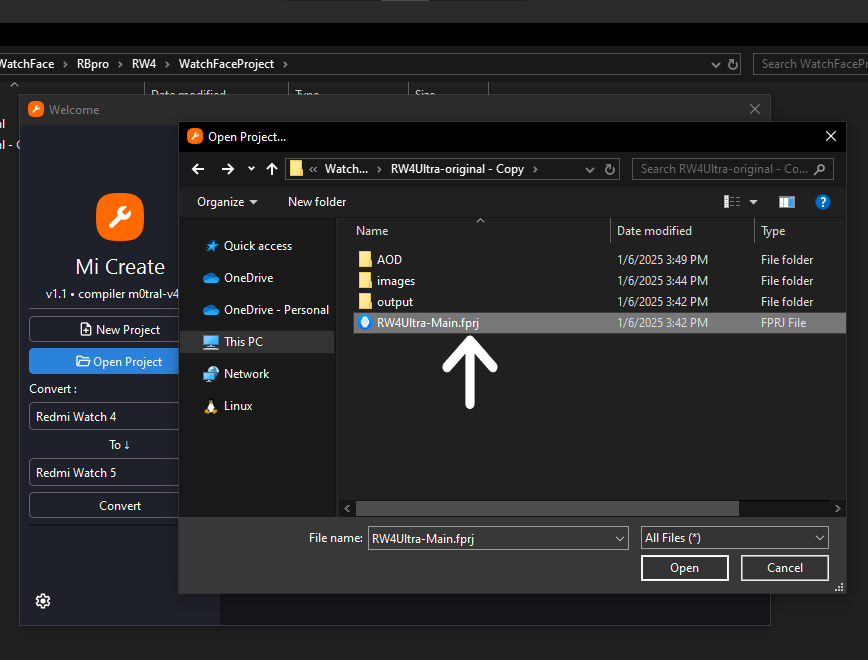
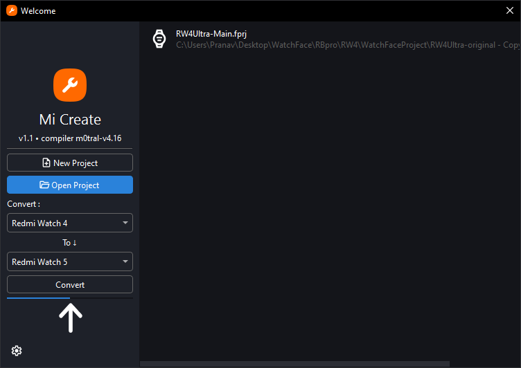
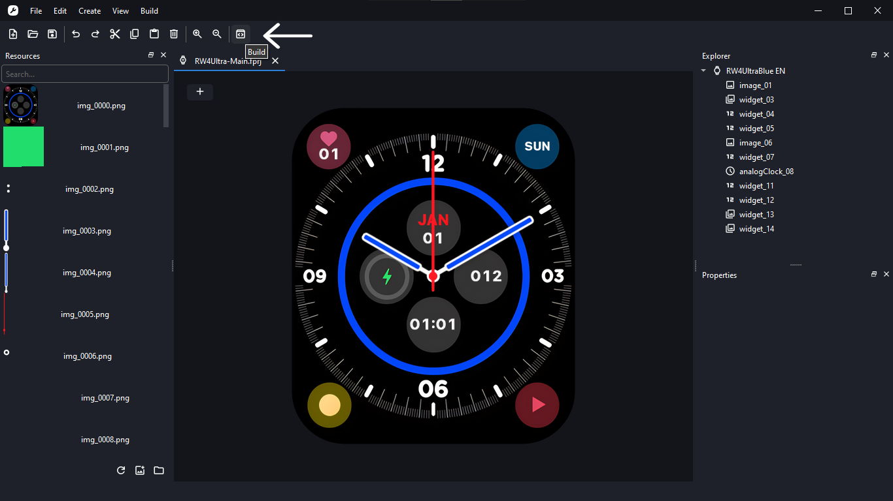
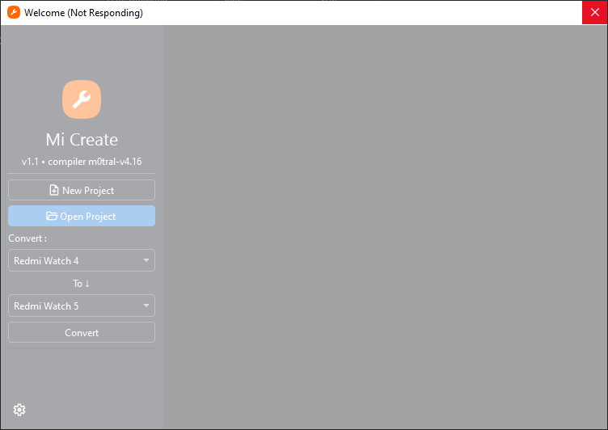

<br />
<h2 align="center"> Mi-Create-Convert</h2>
<p align="center"> Unofficial watchface creator for Xiaomi Wearables. Compatible with all Xiaomi wearables made ~2021 and above with Convert feature.</p>
<p align="center"> This is a fork of Mi-Create by ooflet with enhanced functionality to convert watch faces between devices seamlessly.</p>
<p align="center"> Designed to bridge the gap between various Xiaomi devices and enable watch face customization like never before.</p>

<p align="center">
    
    
</p>


## Thanks to Ooflet for [Mi-Create](https://github.com/ooflet/Mi-Create)

---

## Key Features:
- Convert watch faces between Xiaomi devices.
- Support for various resolutions and layouts.
- Seamlessly integrates all Mi-Create [features](https://github.com/ooflet/Mi-Create?tab=readme-ov-file#features).
- Included latest v418 compiler for compatibility with all devices.
  

## How To Convert:

1. **Make a copy** of the project you want to convert.
2. **Select device types** in the Convert menu.
3. Choose the `.fprj` project file (if the project has an AOD face, convert that before compiling the main face).
4. **Wait** for the progress bar to finish (it might briefly go into the "Not Responding" state; give it one minute).
5. After conversion, click "Build" to compile the project.

### Compatibility Notes:
- Supported devices-
        Mi Color2/S1/S2,
        Mi Watch S1 pro,
        Redmi Watch 3,
        Redmi Watch 3 Active,
        Redmi Watch 5 Active,
        Redmi Watch 5 Lite,
        Redmi Band Pro,
        Mi band 8,
        Mi band 9,
        Mi band 9 pro,
        Mi band 8 pro,
        Mi band 7 pro,
        Mi watch S3,
        Mi watch S4,
        Redmi Watch 4,
        Redmi Watch 5

- Ensure sufficient storage (~310MB) for installation and operation.
- Always work with a copy of the project as the conversion process overwrites original images.
- Compiler Path:
`C:\Users\%USERPROFILE%\AppData\Local\Programs\Mi Create C\compiler`
- DeviceInfo.db Path:
`C:\Users\%USERPROFILE%\AppData\Local\Programs\Mi Create C\data`

---

## Installation:

### Windows
- Download the latest installer from the [releases](https://github.com/Pranav-ONLY/Mi-Create/releases) tab.
- **Supported OS:** 64-bit versions of Windows 10 (1809 or later) and Windows 11.

### Running from Source
If you prefer running from source:
1. Clone or download the source code from GitHub.
2. Install Python version 3.12 or above.
3. Create a Python virtual environment (optional but recommended).
4. Install dependencies:
   ```bash
   pip install -r requirements.txt
   ```
   or
   ```bash
   python -m pip install -r requirements.txt
   ```
5. Execute `main.py` to launch the application.

> Note: Logs will output to the console when running from source.

---

## Troubleshooting
Mi-Create-Convert may encounter occasional bugs or issues. Common troubleshooting steps:
- If the app freezes or shows "Not Responding," wait at least one minute, it is still working.
- For persistent issues, report them with the main log file attached. 
  - Default location on Windows: `C:\Users\{username}\AppData\Local\Programs\Mi Create Convert\data\app.log`

---

## Redistribution
Redistribution is permitted with appropriate credit to this repository. Please link back to the GitHub project in your description or post.

To compile for different platforms, use **Nuitka**, which provides additional performance benefits and compatibility checks embedded in the program.

---

## Licensing:
Mi-Create-Convert is licensed under the GPL-3 license. [View what you can and can't do](https://gist.github.com/kn9ts/cbe95340d29fc1aaeaa5dd5c059d2e60).  
Please note that the compiler is made by a third party and is **NOT** open source.

---

## Additional Resources
- [Documentation for Mi-Create](https://ooflet.github.io/docs)
- [Discussions](https://github.com/ooflet/Mi-Create/discussions) for questions and ideas
- [Issue Tracker](https://github.com/ooflet/Mi-Create/issues) for bug reports and feature requests

---

## Screenshots:
Add screenshots of the "Convert" feature and other unique functionality here.

